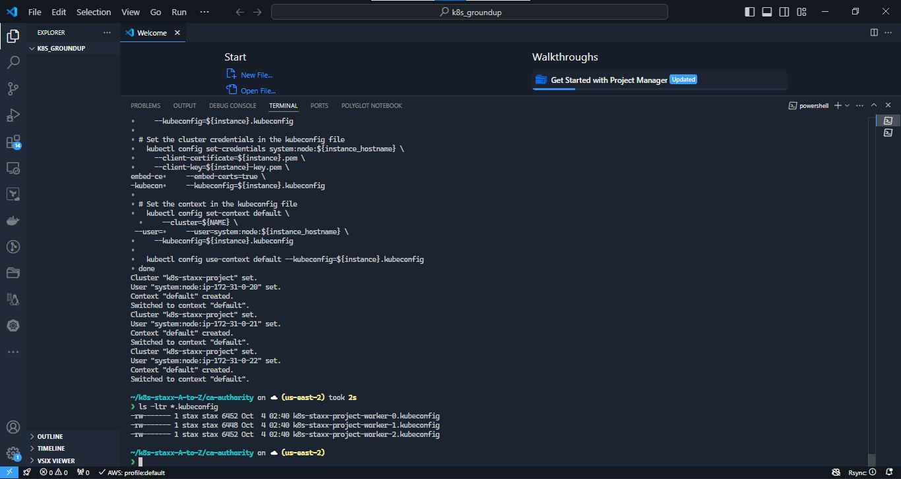

### Cluster Set Up

For the cluster, create 6 EC2 instances, which will have the following movings parts properly configured:

* 3 Kubernetes master nodes
* 3 kubernetes worker nodes
* Configured SSl/TLS certificates for kubernetes components to communicate securely
* Configured node network
* Configured Pod network.


The kubernetes cluster will have an architecture like above but with our specified number of worker and master nodes, these nodes will be run in EC2 instances.
Ideally the set-up is swiftly automated with terraform, but here we will use ```awscli``` to spin the cluster the hard way, for learning purposes.

### AWS Cloud resources for Kubernetes Cluster


### Step 1 - Configure Network Infrastructure

1. Create a directory named ```k8s-manual-setup```

2. Create a VPC and store the ID as a  variable:
```
VPC_ID=$(aws ec2 create-vpc \
  --cidr-block 172.31.0.0/16 \
  --output text --query 'Vpc.VpcId'
  )

```
3. Tag the VPC to assign a name to it:

```
NAME=k8s-manual-setup

aws ec2 create-tags \
  --resources ${VPC_ID} \
  --tags Key=Name,Value=${NAME}
```

**Domain Name System - DNS**

4. Enable DNS support for the VPC:

```
aws ec2 modify-vpc-attribute \
  --vpc-id ${VPC_ID} \
  --enable-dns-support '{"Value": true}'
``` 

5. Enable DNS support for hostnames:

```
aws ec2 modify-vpc-attribute \
  --vpc-id ${VPC_ID} \
  --enable-dns-hostnames '{"Value": true}'
```

**AWS Region**
6. Set the required region

```
AWS_REGION=us-east-2
```
**Subnet**
7. Create the subnet:
```
SUBNET_ID=$(aws ec2 create-subnet \
  --vpc-id ${VPC_ID} \
  --cidr-block 172.31.0.0/24 \
  --output text --query 'Subnet.SubnetId')
aws ec2 create-tags \
  --resources ${SUBNET_ID} \
  --tags Key=Name,Value=${NAME}
```

**Internet gateway**

8. Create the Internet Gateway and attacht it t the VPC:

```
INTERNET_GATEWAY_ID=$(aws ec2 create-internet-gateway \
  --output text --query 'InternetGateway.InternetGatewayId')
aws ec2 create-tags \
  --resources ${INTERNET_GATEWAY_ID} \
  --tags Key=Name,Value=${NAME}
aws ec2 attach-internet-gateway \
  --internet-gateway-id ${INTERNET_GATEWAY_ID} \
  --vpc-id ${VPC_ID}
``` 
**Route tables**

9. Create route tables, associate the route table to subnet, and create a route to allow external traffic to the Internet through the Internet Gateway:

```
ROUTE_TABLE_ID=$(aws ec2 create-route-table \
  --vpc-id ${VPC_ID} \
  --output text --query 'RouteTable.RouteTableId')
aws ec2 create-tags \
  --resources ${ROUTE_TABLE_ID} \
  --tags Key=Name,Value=${NAME}
aws ec2 associate-route-table \
  --route-table-id ${ROUTE_TABLE_ID} \
  --subnet-id ${SUBNET_ID}
aws ec2 create-route \
  --route-table-id ${ROUTE_TABLE_ID} \
  --destination-cidr-block 0.0.0.0/0 \
  --gateway-id ${INTERNET_GATEWAY_ID}
``` 
**output**
```
{
    "AssociationId": "rtbassoc-07a8877e92504def7",
    "AssociationState": {
        "State": "associated"
    }
}
{
    "Return": true
}

```

**Security Groups**

10. Configure security groups

```
# Create the security group and store its ID in a variable
SECURITY_GROUP_ID=$(aws ec2 create-security-group \
  --group-name ${NAME} \
  --description "Kubernetes cluster security group" \
  --vpc-id ${VPC_ID} \
  --output text --query 'GroupId')

# Create the NAME tag for the security group
aws ec2 create-tags \
  --resources ${SECURITY_GROUP_ID} \
  --tags Key=Name,Value=${NAME}
  
# Create Inbound traffic for all communication within the subnet to connect on ports used by the master node(s)
aws ec2 authorize-security-group-ingress \
    --group-id ${SECURITY_GROUP_ID} \
    --ip-permissions IpProtocol=tcp,FromPort=2379,ToPort=2380,IpRanges='[{CidrIp=172.31.0.0/24}]'

# # Create Inbound traffic for all communication within the subnet to connect on ports used by the worker nodes
aws ec2 authorize-security-group-ingress \
    --group-id ${SECURITY_GROUP_ID} \
    --ip-permissions IpProtocol=tcp,FromPort=30000,ToPort=32767,IpRanges='[{CidrIp=172.31.0.0/24}]'

# Create inbound traffic to allow connections to the Kubernetes API Server listening on port 6443
aws ec2 authorize-security-group-ingress \
  --group-id ${SECURITY_GROUP_ID} \
  --protocol tcp \
  --port 6443 \
  --cidr 0.0.0.0/0

# Create Inbound traffic for SSH from anywhere (Do not do this in production. Limit access ONLY to IPs or CIDR that MUST connect)
aws ec2 authorize-security-group-ingress \
  --group-id ${SECURITY_GROUP_ID} \
  --protocol tcp \
  --port 22 \
  --cidr 0.0.0.0/0

# Create ICMP ingress for all types
aws ec2 authorize-security-group-ingress \
  --group-id ${SECURITY_GROUP_ID} \
  --protocol icmp \
  --port -1 \
  --cidr 0.0.0.0/0
```
**Network Load Balancer**

11. Create a network Load balancer,

```
LOAD_BALANCER_ARN=$(aws elbv2 create-load-balancer \
  --name ${NAME} \
  --subnets ${SUBNET_ID} \
  --scheme internet-facing \
  --type network \
  --output text --query 'LoadBalancers[].LoadBalancerArn')
```
**Target Group**
12. Create a target group: (For now it will be unhealthy because there are no real targets yet.)

```
TARGET_GROUP_ARN=$(aws elbv2 create-target-group \
  --name ${NAME} \
  --protocol TCP \
  --port 6443 \
  --vpc-id ${VPC_ID} \
  --target-type ip \
  --output text --query 'TargetGroups[].TargetGroupArn')
``` 

13. Register targets: (Just like above, no real targets. You will just put the IP addresses so that, when the nodes become available, they will be used as targets.)

```
aws elbv2 register-targets \
  --target-group-arn ${TARGET_GROUP_ARN} \
  --targets Id=172.31.0.1{0,1,2}
``` 

14. Create a listener to listen for requests and forward to the target nodes on TCP port `6443`

```
	aws elbv2 create-listener \
  --load-balancer-arn ${LOAD_BALANCER_ARN} \
  --protocol TCP \
  --port 6443 \
  --default-actions Type=forward,TargetGroupArn=${TARGET_GROUP_ARN} \
  --output text --query 'Listeners[].ListenerArn'
```

**K8s Public Address**

15. Get the Kubernetes Public address
```
KUBERNETES_PUBLIC_ADDRESS=$(aws elbv2 describe-load-balancers \
  --load-balancer-arns ${LOAD_BALANCER_ARN} \
  --output text --query 'LoadBalancers[].DNSName')

```

*Note how we just manually created the network infrastructure, with no automations.*
*Next lets create the compute resources*

### Step 2 - Create Compute Resources

**AMI**

1. Get an image to create EC2 instances:

```
IMAGE_ID=$(aws ec2 describe-images --owners 099720109477 \
  --filters \
  'Name=root-device-type,Values=ebs' \
  'Name=architecture,Values=x86_64' \
  'Name=name,Values=ubuntu-pro-server/images/hvm-ssd/ubuntu-xenial-16.04-amd64-pro-server-20240917' \
  | jq -r '.Images|sort_by(.Name)[-1]|.ImageId')
```

**SSH key-pair**

2. Create SSH Key-Pair
 ```
 mkdir -p ssh

aws ec2 create-key-pair \
  --key-name ${NAME} \
  --output text --query 'KeyMaterial' \
  > ssh/${NAME}.id_rsa
chmod 600 ssh/${NAME}.id_rsa
```
**EC2 Instances for Controle Plane (Master Nodes)**
3. Create 3 Master nodes: 
**Note** - Using ```t2.micro``` instead of ```t2.small``` as ```t2.micro``` is covered by AWS free tier

```
for i in 0 1 2; do
  instance_id=$(aws ec2 run-instances \
    --associate-public-ip-address \
    --image-id ${IMAGE_ID} \
    --count 1 \
    --key-name ${NAME} \
    --security-group-ids ${SECURITY_GROUP_ID} \
    --instance-type t2.micro \
    --private-ip-address 172.31.0.1${i} \
    --user-data "name=master-${i}" \
    --subnet-id ${SUBNET_ID} \
    --output text --query 'Instances[].InstanceId')
  aws ec2 modify-instance-attribute \
    --instance-id ${instance_id} \
    --no-source-dest-check
  aws ec2 create-tags \
    --resources ${instance_id} \
    --tags "Key=Name,Value=${NAME}-master-${i}"
done
``` 


**EC2 Instances for Worker Nodes**
1. Create 3 worker nodes:

```
for i in 0 1 2; do
  instance_id=$(aws ec2 run-instances \
    --associate-public-ip-address \
    --image-id ${IMAGE_ID} \
    --count 1 \
    --key-name ${NAME} \
    --security-group-ids ${SECURITY_GROUP_ID} \
    --instance-type t2.micro \
    --private-ip-address 172.31.0.2${i} \
    --user-data "name=worker-${i}|pod-cidr=172.20.${i}.0/24" \
    --subnet-id ${SUBNET_ID} \
    --output text --query 'Instances[].InstanceId')
  aws ec2 modify-instance-attribute \
    --instance-id ${instance_id} \
    --no-source-dest-check
  aws ec2 create-tags \
    --resources ${instance_id} \
    --tags "Key=Name,Value=${NAME}-worker-${i}"
done
```
*Now we have created the nodes. Next, we create some kind of security so that the resources/entities within the nodes can have a secure connection*

#### Step 3 Prepare The Self-Signed Certificate Authority And Generate TLS Certificates
*The following components running on the Master node will require TLS certificates.*

* kube-controller-manager
* kube-scheduler
* etcd
* kube-apiserver
* kubelet
* kube-proxy

*The following components running on the Worker nodes will require TLS certificates.*

* kubelet
* kube-proxy

For this, lets provision a **PKI** - *Public key infrastructure* using the ```cfssl``` which will have a Certificate Authority.
The CA will then generate certificates for all the individual components.

**PS** - ```cfssl``` is a PKI toolkit by CloudFare and can also be used as a CA. There are a couple of other functionalities cfssl has.


**Self-Signed Root Certificate Authority (CA)**

Here, lets provision a CA that will be used to sign additional TLS certificates.

Create a directory and ```cd``` into it:

```
mkdir ca-authority && cd ca-authority
``` 

Generate the CA configuration file, Root Certificate, and Private key:

```
{

cat > ca-config.json <<EOF
{
  "signing": {
    "default": {
      "expiry": "8760h"
    },
    "profiles": {
      "kubernetes": {
        "usages": ["signing", "key encipherment", "server auth", "client auth"],
        "expiry": "8760h"
      }
    }
  }
}
EOF

cat > ca-csr.json <<EOF
{
  "CN": "Kubernetes",
  "key": {
    "algo": "rsa",
    "size": 2048
  },
  "names": [
    {
      "C": "UK",
      "L": "England",
      "O": "Kubernetes",
      "OU": "staxx.io",
      "ST": "London"
    }
  ]
}
EOF

cfssl gencert -initca ca-csr.json | cfssljson -bare ca

}
``` 
The file defines the following:

```
CN – Common name for the authority

algo – the algorithm used for the certificates

size – algorithm size in bits

C – Country

L – Locality (city)

ST – State or province

O – Organization

OU – Organizational Unit

``` 

**Output**

```
2021/05/16 20:18:44 [INFO] generating a new CA key and certificate from CSR
2021/05/16 20:18:44 [INFO] generate received request
2021/05/16 20:18:44 [INFO] received CSR
2021/05/16 20:18:44 [INFO] generating key: rsa-2048
2021/05/16 20:18:44 [INFO] encoded CSR
2021/05/16 20:18:44 [INFO] signed certificate with serial number 478642753175858256977534824638605235819766817855
``` 
``` ls -ltr ```to list the created files.

The 3 important files here are:

* ca.pem - The Root Certificate
* ca-key.pem - The Private Key
* ca.csr - The Certificate Signing Request


**Generating TLS Certificates For Client and Server
**

You will need to provision Client/Server certificates for all the components. It is a **MUST** to have encrypted communication within the cluster. Therefore, the **server** here are the master nodes running the **api-server** component. While the **client** is every other component that needs to communicate with the api-server.

Now we have a certificate for the Root CA, we can then begin to request more certificates which the different Kubernetes components, i.e. clients and server, will use to have encrypted communication.

Remember, the clients here refer to every other component that will communicate with the **api-server**. These are:

* kube-controller-manager
* kube-scheduler
* etcd
* kubelet
* kube-proxy
* Kubernetes Admin User

**Let us begin with the Kubernetes API-Server Certificate and Private Key** 
The certificate for the Api-server must have IP addresses, DNS names, and a Load Balancer address included. Otherwise, you will have a lot of difficulties connecting to the ```api-server```.

1. Generate the **Certificate Signing Request (CSR), Private Key** and the **Certificate** for the Kubernetes Master Nodes.

```
{
cat > master-kubernetes-csr.json <<EOF
{
  "CN": "kubernetes",
   "hosts": [
   "127.0.0.1",
   "172.31.0.10",
   "172.31.0.11",
   "172.31.0.12",
   "ip-172-31-0-10",
   "ip-172-31-0-11",
   "ip-172-31-0-12",
   "ip-172-31-0-10.${AWS_REGION}.compute.internal",
   "ip-172-31-0-11.${AWS_REGION}.compute.internal",
   "ip-172-31-0-12.${AWS_REGION}.compute.internal",
   "${KUBERNETES_PUBLIC_ADDRESS}",
   "kubernetes",
   "kubernetes.default",
   "kubernetes.default.svc",
   "kubernetes.default.svc.cluster",
   "kubernetes.default.svc.cluster.local"
  ],
  "key": {
    "algo": "rsa",
    "size": 2048
  },
  "names": [
    {
      "C": "UK",
      "L": "England",
      "O": "Kubernetes",
      "OU": "staxx.io",
      "ST": "London"
    }
  ]
}
EOF

cfssl gencert \
  -ca=ca.pem \
  -ca-key=ca-key.pem \
  -config=ca-config.json \
  -profile=kubernetes \
  master-kubernetes-csr.json | cfssljson -bare master-kubernetes
}

``` 


**Creating the other certificates: for the following Kubernetes components:**

* Scheduler Client Certificate
* Kube Proxy Client Certificate
* Controller Manager Client Certificate
* Kubelet Client Certificates
* K8s admin user Client Certificate

2. ```kub3-scheduler``` **Client Certificate and Private Key**

```
{

cat > kube-scheduler-csr.json <<EOF
{
  "CN": "system:kube-scheduler",
  "key": {
    "algo": "rsa",
    "size": 2048
  },
  "names": [
    {
      "C": "UK",
      "L": "England",
      "O": "system:kube-scheduler",
      "OU": "staxx.io",
      "ST": "London"
    }
  ]
}
EOF

cfssl gencert \
  -ca=ca.pem \
  -ca-key=ca-key.pem \
  -config=ca-config.json \
  -profile=kubernetes \
  kube-scheduler-csr.json | cfssljson -bare kube-scheduler

}
``` 
 ***If you see any warning message, it is safe to ignore it.***

3. ```kube-proxy``` Client certificate and Private Key

```
{

cat > kube-proxy-csr.json <<EOF
{
  "CN": "system:kube-proxy",
  "key": {
    "algo": "rsa",
    "size": 2048
  },
  "names": [
    {
      "C": "UK",
      "L": "England",
      "O": "system:node-proxier",
      "OU": "staxx.io",
      "ST": "London"
    }
  ]
}
EOF

cfssl gencert \
  -ca=ca.pem \
  -ca-key=ca-key.pem \
  -config=ca-config.json \
  -profile=kubernetes \
  kube-proxy-csr.json | cfssljson -bare kube-proxy

}
``` 

4. ```kube-controller-manager``` **Client Certificate and Private Key**

```
{
cat > kube-controller-manager-csr.json <<EOF
{
  "CN": "system:kube-controller-manager",
  "key": {
    "algo": "rsa",
    "size": 2048
  },
  "names": [
    {
      "C": "UK",
      "L": "England",
      "O": "system:kube-controller-manager",
      "OU": "staxx.io",
      "ST": "London"
    }
  ]
}
EOF

cfssl gencert \
  -ca=ca.pem \
  -ca-key=ca-key.pem \
  -config=ca-config.json \
  -profile=kubernetes \
  kube-controller-manager-csr.json | cfssljson -bare kube-controller-manager

}
``` 

5. ```kubelet``` Client Certificate and Private Key

Similar to how you configured the ```api-server's``` certificate, Kubernetes requires that the hostname of each worker node is included in the client certificate.
Also, Kubernetes uses a special-purpose authorization mode called ```Node Authorizer```, that specifically authorizes API requests made by ```kubelet``` services. In order to be authorized by the Node Authorizer, ```kubelets``` must use a credential that identifies them as being in the ```system:nodes``` **group**, with a username of ```system:node:<nodeName>```. Notice the ``"CN"``: ```"system:node:${instance_hostname}"```, in the below code.

Therefore, the certificate to be created must comply to these requirements. In the below example, there are 3 worker nodes, hence we will use bash to loop through a list of the worker nodes' hostnames, and based on each index, the respective Certificate Signing Request (CSR), private key and client certificates will be generated.

```
for i in 0 1 2; do
  instance="${NAME}-worker-${i}"
  instance_hostname="ip-172-31-0-2${i}"
  cat > ${instance}-csr.json <<EOF
{
  "CN": "system:node:${instance_hostname}",
  "key": {
    "algo": "rsa",
    "size": 2048
  },
  "names": [
    {
      "C": "UK",
      "L": "England",
      "O": "system:nodes",
      "OU": "staxx.io",
      "ST": "London"
    }
  ]
}
EOF

  external_ip=$(aws ec2 describe-instances \
    --filters "Name=tag:Name,Values=${instance}" \
    --output text --query 'Reservations[].Instances[].PublicIpAddress')

  internal_ip=$(aws ec2 describe-instances \
    --filters "Name=tag:Name,Values=${instance}" \
    --output text --query 'Reservations[].Instances[].PrivateIpAddress')

  cfssl gencert \
    -ca=ca.pem \
    -ca-key=ca-key.pem \
    -config=ca-config.json \
    -hostname=${instance_hostname},${external_ip},${internal_ip} \
    -profile=kubernetes \
    ${NAME}-worker-${i}-csr.json | cfssljson -bare ${NAME}-worker-${i}
done
```

6. Finally, ```kubernetes admin user's``` **Client Certificate and Private Key**

```
{
cat > admin-csr.json <<EOF
{
  "CN": "admin",
  "key": {
    "algo": "rsa",
    "size": 2048
  },
  "names": [
    {
      "C": "UK",
      "L": "England",
      "O": "system:masters",
      "OU": "staxx.io",
      "ST": "London"
    }
  ]
}
EOF

cfssl gencert \
  -ca=ca.pem \
  -ca-key=ca-key.pem \
  -config=ca-config.json \
  -profile=kubernetes \
  admin-csr.json | cfssljson -bare admin
}
```
7.  Certificate and Private key for **Token Controller**

**Token Controller**: a part of the Kubernetes Controller Manager ```kube-controller-manager``` responsible for generating and signing service account tokens which are used by *pods* or other *resources* to establish connectivity to the ```api-server```. Read more about Service Accounts from the [official documentation.](https://kubernetes.io/docs/reference/access-authn-authz/service-accounts-admin/)

```
{

cat > service-account-csr.json <<EOF
{
  "CN": "service-accounts",
  "key": {
    "algo": "rsa",
    "size": 2048
  },
  "names": [
    {
      "C": "UK",
      "L": "England",
      "O": "Kubernetes",
      "OU": "staxx.io",
      "ST": "London"
    }
  ]
}
EOF

cfssl gencert \
  -ca=ca.pem \
  -ca-key=ca-key.pem \
  -config=ca-config.json \
  -profile=kubernetes \
  service-account-csr.json | cfssljson -bare service-account
}
``` 

#### Step 4 - Distributing the Client and Server Certificates

Send all the client and server certificates created earlier to their respective instances.

Begin with certificates that for the **worker nodes**

Copy these files securely to the worker nodes using **scp** utility.

* Root CA  certificate - ca.pem
* X509 Certificate for each worker node
* Private Key of the certificate for each worker node

```
for i in 0 1 2; do
  instance="${NAME}-worker-${i}"
  external_ip=$(aws ec2 describe-instances \
    --filters "Name=tag:Name,Values=${instance}" \
    --output text --query 'Reservations[].Instances[].PublicIpAddress')
  scp -i ../ssh/${NAME}.id_rsa \
    ca.pem ${instance}-key.pem ${instance}.pem ubuntu@${external_ip}:~/; \
done
``` 


**Master or Controller node**: - Note that only the ```api-server``` related files will be sent over to the master nodes.

```
for i in 0 1 2; do
instance="${NAME}-master-${i}" \
  external_ip=$(aws ec2 describe-instances \
    --filters "Name=tag:Name,Values=${instance}" \
    --output text --query 'Reservations[].Instances[].PublicIpAddress')
  scp -i ../ssh/${NAME}.id_rsa \
    ca.pem ca-key.pem service-account-key.pem service-account.pem \
    master-kubernetes.pem master-kubernetes-key.pem ubuntu@${external_ip}:~/;
done
```

The ```kube-proxy```, ```kube-controller-manager```, ```kube-scheduler```, and ```kubelet client certificates``` will be used to generate client authentication configuration files later.

#### Step 5 Use ```kubectl``` to Generate Kubernetes Configuration Files for Authentication

To ensure the kubernetes cluster runs as it should, a file known as ```kubeconfig``` must be created. This file enables lubernetes clients to locate and authenticate to the kubernetes API Servers.
The client tool ```kubectl``` will be used to do this.

Generate kubeconfig files for the **kubelet**, **controller manager**, **kube-proxy**, and **scheduler clients** and then the **admin** user. 
First, create a few environement variables for reuse by multiple commands.

```
KUBERNETES_API_SERVER_ADDRESS=$(aws elbv2 describe-load-balancers --load-balancer-arns ${LOAD_BALANCER_ARN} --output text --query 'LoadBalancers[].DNSName')
``` 
1. Generate the **kubelet** kubeconfig file

For each of the nodes running the kubelet component, it is very important that the client certificate configured for that node is used to generate the kubeconfig. This is because each certificate has the node's DNS name or IP Address configured at the time the certificate was generated. It will also ensure that the appropriate authorization is applied to that node through the [Node Authorizer](https://kubernetes.io/docs/reference/access-authn-authz/node/)

Run the below command in the directory where all the certificates were generated.

```
for i in 0 1 2; do

instance="${NAME}-worker-${i}"
instance_hostname="ip-172-31-0-2${i}"

# Set the kubernetes cluster in the kubeconfig file
  kubectl config set-cluster ${NAME} \
    --certificate-authority=ca.pem \
    --embed-certs=true \
    --server=https://$KUBERNETES_API_SERVER_ADDRESS:6443 \
    --kubeconfig=${instance}.kubeconfig

# Set the cluster credentials in the kubeconfig file
  kubectl config set-credentials system:node:${instance_hostname} \
    --client-certificate=${instance}.pem \
    --client-key=${instance}-key.pem \
    --embed-certs=true \
    --kubeconfig=${instance}.kubeconfig

# Set the context in the kubeconfig file
  kubectl config set-context default \
    --cluster=${NAME} \
    --user=system:node:${instance_hostname} \
    --kubeconfig=${instance}.kubeconfig

  kubectl config use-context default --kubeconfig=${instance}.kubeconfig
done
``` 

Inspect the **output**, List the  output

```
ls -ltr *.kubeconfig
```


Open up the ```kubeconfig``` files generated and review the 3 different sections that have been configured:
**Reacall:** Kubeconfig file stores information about a kubernetes cluster, inclusind authentication credentials and cluster specific settings.

A ```Kubeconfig``` file contains:

* Cluster
* Credentials
* And Kube context

By default, ```kubectl``` looks for a file named ```config``` in the ```$HOME/.kube``` directory. You can specify other kubeconfig files by setting the KUBECONFIG environment variable or by setting the ```--kubeconfig``` flag. 

To get to know more how to create your own kubeconfig files - read[ this documentation.](https://kubernetes.io/docs/concepts/configuration/organize-cluster-access-kubeconfig/)

**Context** part of ```kubeconfig``` file defines three main parameters: cluster, namespace and user. You can save several different contexts with any convenient names and switch between them when needed.

```
kubectl config use-context %context-name%
```
2. Generate the kube-proxy kubeconfig

```
{
  kubectl config set-cluster ${NAME} \
    --certificate-authority=ca.pem \
    --embed-certs=true \
    --server=https://${KUBERNETES_API_SERVER_ADDRESS}:6443 \
    --kubeconfig=kube-proxy.kubeconfig

  kubectl config set-credentials system:kube-proxy \
    --client-certificate=kube-proxy.pem \
    --client-key=kube-proxy-key.pem \
    --embed-certs=true \
    --kubeconfig=kube-proxy.kubeconfig

  kubectl config set-context default \
    --cluster=${NAME} \
    --user=system:kube-proxy \
    --kubeconfig=kube-proxy.kubeconfig

  kubectl config use-context default --kubeconfig=kube-proxy.kubeconfig
}

``` 

3. Generate the **Kube-Controller-Manager** kubeconfig
Notice that the ```--server``` is set to use ```127.0.0.1```. This is because, this component runs on the API-Server so there is no point routing through the Load Balancer

```
{
  kubectl config set-cluster ${NAME} \
    --certificate-authority=ca.pem \
    --embed-certs=true \
    --server=https://127.0.0.1:6443 \
    --kubeconfig=kube-controller-manager.kubeconfig

  kubectl config set-credentials system:kube-controller-manager \
    --client-certificate=kube-controller-manager.pem \
    --client-key=kube-controller-manager-key.pem \
    --embed-certs=true \
    --kubeconfig=kube-controller-manager.kubeconfig

  kubectl config set-context default \
    --cluster=${NAME} \
    --user=system:kube-controller-manager \
    --kubeconfig=kube-controller-manager.kubeconfig

  kubectl config use-context default --kubeconfig=kube-controller-manager.kubeconfig
}
``` 

4. Generating the **Kube-Scheduler** Kubeconfig

```
{
  kubectl config set-cluster ${NAME} \
    --certificate-authority=ca.pem \
    --embed-certs=true \
    --server=https://127.0.0.1:6443 \
    --kubeconfig=kube-scheduler.kubeconfig

  kubectl config set-credentials system:kube-scheduler \
    --client-certificate=kube-scheduler.pem \
    --client-key=kube-scheduler-key.pem \
    --embed-certs=true \
    --kubeconfig=kube-scheduler.kubeconfig

  kubectl config set-context default \
    --cluster=${NAME} \
    --user=system:kube-scheduler \
    --kubeconfig=kube-scheduler.kubeconfig

  kubectl config use-context default --kubeconfig=kube-scheduler.kubeconfig
}
```

5. Finally, generate the kubeconfig file for the **admin user**

```
{
  kubectl config set-cluster ${NAME} \
    --certificate-authority=ca.pem \
    --embed-certs=true \
    --server=https://${KUBERNETES_API_SERVER_ADDRESS}:6443 \
    --kubeconfig=admin.kubeconfig

  kubectl config set-credentials admin \
    --client-certificate=admin.pem \
    --client-key=admin-key.pem \
    --embed-certs=true \
    --kubeconfig=admin.kubeconfig

  kubectl config set-context default \
    --cluster=${NAME} \
    --user=admin \
    --kubeconfig=admin.kubeconfig

  kubectl config use-context default --kubeconfig=admin.kubeconfig
}
```

**Lets Distribute the files to their respective servers, using ```scp``` and a ```for``` loop**

**For the worker nodes**  - send the ```kubelet``` and ```kube-proxy``` kubeconfigs

```
for i in 0 1 2; do
  instance="${NAME}-worker-${i}"
  external_ip=$(aws ec2 describe-instances \
    --filters "Name=tag:Name,Values=${instance}" \
    --output text --query 'Reservations[].Instances[].PublicIpAddress')
  scp -i ../ssh/${NAME}.id_rsa \
	${instance}.kubeconfig kube-proxy.kubeconfig \
	ubuntu@${external_ip}:~/; 
done
```


**For the master nodes**  - send the ```admin.kubeconfig```, ```kube-scheduler.kubeconfig```, and  ```kube-controller-manager.kubeconfig```

```
for i in 0 1 2; do
instance="${NAME}-master-${i}" 
  external_ip=$(aws ec2 describe-instances \
    --filters "Name=tag:Name,Values=${instance}" \
    --output text --query 'Reservations[].Instances[].PublicIpAddress')
  scp -i ../ssh/${NAME}.id_rsa \
    admin.kubeconfig kube-scheduler.kubeconfig kube-controller-manager.kubeconfig \
    ubuntu@${external_ip}:~/;
done
```


**Step 5 Secure the ```etcd``` database with encryption at rest.**
```etcd```  is  a distrributed key-value store which kubernetes uses to store data like *cluster state, application configurations, secrets, configmaps etc*. By default, the data that is being persisted to the disk is not encryped, and therefore prone to attack by any party that gains access to the database. This risk is handled by encrypting the etcd.

We will encrypt ```etcd```at rest. Meaning that the data is stored and persists on a disk.
"in-flight" or "in transit" refers to data that is being transferred over the network. 
"In-flight" encryption is done through TLS.

**Generate the encryption key and encode it using base64**

```
ETCD_ENCRYPTION_KEY=$(head -c 32 /dev/urandom | base64) 
``` 


See the output that will be generated when called. Yours will be a different random string.

```
echo $ETCD_ENCRYPTION_KEY
```

**OUTPUT:**

```
OuxSvV5XUQVid4fNNbeyFEDTUPr1yozZPQ+E6Eqj80m1FSVDB6jOHt9miD/7kMdJIvVshlMgxY80wFajlqItug===$
``` 

**Create an ```encryption-config.yamL``` file as documented officially by kubernetes**

```
cat > encryption-config.yaml <<EOF
kind: EncryptionConfig
apiVersion: v1
resources:
  - resources:
      - secrets
    providers:
      - aescbc:
          keys:
            - name: key1
              secret: ${ETCD_ENCRYPTION_KEY}
      - identity: {}
EOF
```

The encryption file will be sent to the **Controller nodes** using ```scp``` and a ```for``` loop.

```
for i in 0 1 2; do
instance="${NAME}-master-${i}" 
  external_ip=$(aws ec2 describe-instances \
    --filters "Name=tag:Name,Values=${instance}" \
    --output text --query 'Reservations[].Instances[].PublicIpAddress')
  scp -i ../ssh/${NAME}.id_rsa \
    encryption-config.yaml \
    ubuntu@${external_ip}:~/;
done
``` 

#### Bootstrap ```etcd``` cluster

The primary purpose of the etcd component is to store the state of the cluster. This is because Kubernetes itself is stateless. Therefore, all its stateful data will persist in etcd. Since Kubernetes is a distributed system - it needs a distributed storage to keep persistent data in it. etcd is a highly-available key value store that fits the purpose. All K8s cluster configurations are stored in a form of key value pairs in etcd, it also stores the actual and desired states of the cluster. etcd cluster is intelligent enough to watch for changes made on one instance and almost instantly replicate those changes to the rest of the instances, so all of them will be always reconciled.

**PS**: [tmux](https://youtu.be/Yl7NFenTgIo) will be used to work with multiple terminal sessions simultaneously.

1. SSH into the controller server

* Master 1

```
  master_1_ip=$(aws ec2 describe-instances \
  --filters "Name=tag:Name,Values=${NAME}-master-0" \
  --output text --query 'Reservations[].Instances[].PublicIpAddress')
  ssh -i k8s-manual-setup.id_rsa  ubuntu@${master_1_ip}
```


* Master 2

```
master_2_ip=$(aws ec2 describe-instances \
  --filters "Name=tag:Name,Values=${NAME}-master-1" \
  --output text --query 'Reservations[].Instances[].PublicIpAddress')
  ssh -i k8s-manual-setup.id_rsa  ubuntu@${master_2_ip}
```


* Master 3

```
master_3_ip=$(aws ec2 describe-instances \
  --filters "Name=tag:Name,Values=${NAME}-master-2" \
  --output text --query 'Reservations[].Instances[].PublicIpAddress')
  ssh -i k8s-manual-setup.id_rsa  ubuntu@${master_3_ip}
```
Working tmux enables you to do these things faster in different instances/windows.
For example below


2. Download and install **etcd**

```
  wget -q --show-progress --https-only --timestamping \
  "https://github.com/etcd-io/etcd/releases/download/v3.4.15/etcd-v3.4.15-linux-amd64.tar.gz"
```

3. Extract and install the etcd server and the etcdctl command line utility:

```
{
  tar -xvf etcd-v3.4.15-linux-amd64.tar.gz
  sudo mv etcd-v3.4.15-linux-amd64/etcd* /usr/local/bin/
}
``` 

4. Configure the **etcd** server

```
{
  sudo mkdir -p /etc/etcd /var/lib/etcd
  sudo chmod 700 /var/lib/etcd
  sudo cp ca.pem master-kubernetes-key.pem master-kubernetes.pem /etc/etcd/
}
```
5. The instance internal IP address will be used to serve client requests and communicate with ``` etcd``` cluster peers. To Retrieve the internal IP address for the current compute instance,

run

```
export INTERNAL_IP=$(curl -s http://169.254.169.254/latest/meta-data/local-ipv4)
```
6. Each ```etcd``` member must have a unique name within an ```etcd``` cluster. Set the``` etcd``` name to node Private IP address so it will uniquely identify the machine:

7. Create the ```etcd.service``` systemd unit file:

The flags are well documented [here](https://www.bookstack.cn/read/etcd-3.2.17-en/717bafd59fa87192.md)

```
cat <<EOF | sudo tee /etc/systemd/system/etcd.service
[Unit]
Description=etcd
Documentation=https://github.com/coreos

[Service]
Type=notify
ExecStart=/usr/local/bin/etcd \\
  --name ${ETCD_NAME} \\
  --trusted-ca-file=/etc/etcd/ca.pem \\
  --peer-trusted-ca-file=/etc/etcd/ca.pem \\
  --peer-client-cert-auth \\
  --client-cert-auth \\
  --listen-peer-urls https://${INTERNAL_IP}:2380 \\
  --listen-client-urls https://${INTERNAL_IP}:2379,https://127.0.0.1:2379 \\
  --advertise-client-urls https://${INTERNAL_IP}:2379 \\
  --initial-cluster-token etcd-cluster-0 \\
  --initial-cluster master-0=https://172.31.0.10:2380,master-1=https://172.31.0.11:2380,master-2=https://172.31.0.12:2380 \\
  --cert-file=/etc/etcd/master-kubernetes.pem \\
  --key-file=/etc/etcd/master-kubernetes-key.pem \\
  --peer-cert-file=/etc/etcd/master-kubernetes.pem \\
  --peer-key-file=/etc/etcd/master-kubernetes-key.pem \\
  --initial-advertise-peer-urls https://${INTERNAL_IP}:2380 \\
  --initial-cluster-state new \\
  --data-dir=/var/lib/etcd
Restart=on-failure
RestartSec=5

[Install]
WantedBy=multi-user.target
EOF
``` 

8. Start and enable the ```etcd``` Server

```
{
  sudo systemctl daemon-reload
  sudo systemctl enable etcd
  sudo systemctl start etcd
}
```

9. Verify the ```etcd``` installation

```
sudo ETCDCTL_API=3 etcdctl member list \
  --endpoints=https://127.0.0.1:2379 \
  --cacert=/etc/etcd/ca.pem \
  --cert=/etc/etcd/master-kubernetes.pem \
  --key=/etc/etcd/master-kubernetes-key.pem
``` 

OUTPUT 


```
systemctl status etcd
``` 


Using tmux, run same on ther other master node instances.


####  Bootstrap the `Control Plane`
Here, we will configure the components for the plane on the master/controller nodes.

1. Create the Kubernetes configuration directory:
```
sudo mkdir -p /etc/kubernetes/config
```

2. Download the official Kubernetes release binaries:


```
wget -q --show-progress --https-only --timestamping \
  "https://storage.googleapis.com/kubernetes-release/release/v1.21.0/bin/linux/amd64/kube-apiserver" \
  "https://storage.googleapis.com/kubernetes-release/release/v1.21.0/bin/linux/amd64/kube-controller-manager" \
  "https://storage.googleapis.com/kubernetes-release/release/v1.21.0/bin/linux/amd64/kube-scheduler" \
  "https://storage.googleapis.com/kubernetes-release/release/v1.21.0/bin/linux/amd64/kubectl"
```

3. Install the Kubernetes binaries:

```
{
  chmod +x kube-apiserver kube-controller-manager kube-scheduler kubectl
  sudo mv kube-apiserver kube-controller-manager kube-scheduler kubectl /usr/local/bin/
}
``` 
4. Configure the Kubernetes API Server:

```
{
  sudo mkdir -p /var/lib/kubernetes/

  sudo mv ca.pem ca-key.pem master-kubernetes-key.pem master-kubernetes.pem \
    service-account-key.pem service-account.pem \
    encryption-config.yaml /var/lib/kubernetes/
}
``` 


The instance internal IP address will be used to advertise the API Server to members of the cluster. Retrieve the internal IP address for the current compute instance:

```
export INTERNAL_IP=$(curl -s http://169.254.169.254/latest/meta-data/local-ipv4)
``` 

Create the kube-apiserver.service systemd unit file: [Ensure to read each startup flag used in below systemd file from the documentation here](https://kubernetes.io/docs/reference/command-line-tools-reference/kube-apiserver/)

```
cat <<EOF | sudo tee /etc/systemd/system/kube-apiserver.service
[Unit]
Description=Kubernetes API Server
Documentation=https://github.com/kubernetes/kubernetes

[Service]
ExecStart=/usr/local/bin/kube-apiserver \\
  --advertise-address=${INTERNAL_IP} \\
  --allow-privileged=true \\
  --apiserver-count=3 \\
  --audit-log-maxage=30 \\
  --audit-log-maxbackup=3 \\
  --audit-log-maxsize=100 \\
  --audit-log-path=/var/log/audit.log \\
  --authorization-mode=Node,RBAC \\
  --bind-address=0.0.0.0 \\
  --client-ca-file=/var/lib/kubernetes/ca.pem \\
  --enable-admission-plugins=NamespaceLifecycle,NodeRestriction,LimitRanger,ServiceAccount,DefaultStorageClass,ResourceQuota \\
  --etcd-cafile=/var/lib/kubernetes/ca.pem \\
  --etcd-certfile=/var/lib/kubernetes/master-kubernetes.pem \\
  --etcd-keyfile=/var/lib/kubernetes/master-kubernetes-key.pem\\
  --etcd-servers=https://172.31.0.10:2379,https://172.31.0.11:2379,https://172.31.0.12:2379 \\
  --event-ttl=1h \\
  --encryption-provider-config=/var/lib/kubernetes/encryption-config.yaml \\
  --kubelet-certificate-authority=/var/lib/kubernetes/ca.pem \\
  --kubelet-client-certificate=/var/lib/kubernetes/master-kubernetes.pem \\
  --kubelet-client-key=/var/lib/kubernetes/master-kubernetes-key.pem \\
  --runtime-config='api/all=true' \\
  --service-account-key-file=/var/lib/kubernetes/service-account.pem \\
  --service-account-signing-key-file=/var/lib/kubernetes/service-account-key.pem \\
  --service-account-issuer=https://${INTERNAL_IP}:6443 \\
  --service-cluster-ip-range=172.32.0.0/24 \\
  --service-node-port-range=30000-32767 \\
  --tls-cert-file=/var/lib/kubernetes/master-kubernetes.pem \\
  --tls-private-key-file=/var/lib/kubernetes/master-kubernetes-key.pem \\
  --v=2
Restart=on-failure
RestartSec=5

[Install]
WantedBy=multi-user.target
EOF
```

5. Configure the Kubernetes **Controller Manager:**

Move the kube-controller-manager kubeconfig into place:

```
sudo mv kube-controller-manager.kubeconfig /var/lib/kubernetes/
``` 

Export some variables to retrieve the ```vpc_cidr``` - This will be required for the ```bind-address``` flag:

```
export AWS_METADATA="http://169.254.169.254/latest/meta-data"
export EC2_MAC_ADDRESS=$(curl -s $AWS_METADATA/network/interfaces/macs/ | head -n1 | tr -d '/')
export VPC_CIDR=$(curl -s $AWS_METADATA/network/interfaces/macs/$EC2_MAC_ADDRESS/vpc-ipv4-cidr-block/)
export NAME=k8s-manual-setup
``` 

Create the kube-controller-manager.service systemd unit file:

```
cat <<EOF | sudo tee /etc/systemd/system/kube-controller-manager.service
[Unit]
Description=Kubernetes Controller Manager
Documentation=https://github.com/kubernetes/kubernetes

[Service]
ExecStart=/usr/local/bin/kube-controller-manager \\
  --bind-address=0.0.0.0 \\
  --cluster-cidr=${VPC_CIDR} \\
  --cluster-name=${NAME} \\
  --cluster-signing-cert-file=/var/lib/kubernetes/ca.pem \\
  --cluster-signing-key-file=/var/lib/kubernetes/ca-key.pem \\
  --kubeconfig=/var/lib/kubernetes/kube-controller-manager.kubeconfig \\
  --authentication-kubeconfig=/var/lib/kubernetes/kube-controller-manager.kubeconfig \\
  --authorization-kubeconfig=/var/lib/kubernetes/kube-controller-manager.kubeconfig \\
  --leader-elect=true \\
  --root-ca-file=/var/lib/kubernetes/ca.pem \\
  --service-account-private-key-file=/var/lib/kubernetes/service-account-key.pem \\
  --service-cluster-ip-range=172.32.0.0/24 \\
  --use-service-account-credentials=true \\
  --v=2
Restart=on-failure
RestartSec=5

[Install]
WantedBy=multi-user.target
EOF
```

6. Configure the **Kubernetes Scheduler:**

Move the kube-scheduler kubeconfig into place:

```
sudo mv kube-scheduler.kubeconfig /var/lib/kubernetes/
sudo mkdir -p /etc/kubernetes/config
``` 
Create the kube-scheduler.yaml configuration file:

```
cat <<EOF | sudo tee /etc/kubernetes/config/kube-scheduler.yaml
apiVersion: kubescheduler.config.k8s.io/v1beta1
kind: KubeSchedulerConfiguration
clientConnection:
  kubeconfig: "/var/lib/kubernetes/kube-scheduler.kubeconfig"
leaderElection:
  leaderElect: true
EOF
```
Create the kube-scheduler.service systemd unit file:

```
cat <<EOF | sudo tee /etc/systemd/system/kube-scheduler.service
[Unit]
Description=Kubernetes Scheduler
Documentation=https://github.com/kubernetes/kubernetes

[Service]
ExecStart=/usr/local/bin/kube-scheduler \\
  --config=/etc/kubernetes/config/kube-scheduler.yaml \\
  --v=2
Restart=on-failure
RestartSec=5

[Install]
WantedBy=multi-user.target
EOF
```

7. Start the Controller Services

```
{
  sudo systemctl daemon-reload
  sudo systemctl enable kube-apiserver kube-controller-manager kube-scheduler
  sudo systemctl start kube-apiserver kube-controller-manager kube-scheduler
}

``` 

Check the status of the services. Start with the ```kube-scheduler``` and  ```kube-controller-manage```r. It may take up to 20 seconds for ```kube-apiserver``` to be fully loaded.


```
{
sudo systemctl status kube-apiserver
sudo systemctl status kube-controller-manager
sudo systemctl status kube-scheduler
}
```


#### Test that Everything is working fine

1. To get the cluster details run:

```
kubectl cluster-info  --kubeconfig admin.kubeconfig
``` 


2. To get the current namespaces:

``` 
kubectl get namespaces --kubeconfig admin.kubeconfig
```


3. To reach the Kubernetes API Server publicly

```
curl --cacert /var/lib/kubernetes/ca.pem https://$INTERNAL_IP:6443/version
``` 

OUTPUT:


4. To get the status of each component:

```
kubectl get componentstatuses --kubeconfig admin.kubeconfig
```


5. On one of the **controller nodes**, configure Role Based Access Control (RBAC) so that the `api-server` has necessary authorization for the `kubelet`.
Create the **ClusterRole:**

``` 
cat <<EOF | kubectl apply --kubeconfig admin.kubeconfig -f -
apiVersion: rbac.authorization.k8s.io/v1
kind: ClusterRole
metadata:
  annotations:
    rbac.authorization.kubernetes.io/autoupdate: "true"
  labels:
    kubernetes.io/bootstrapping: rbac-defaults
  name: system:kube-apiserver-to-kubelet
rules:
  - apiGroups:
      - ""
    resources:
      - nodes/proxy
      - nodes/stats
      - nodes/log
      - nodes/spec
      - nodes/metrics
    verbs:
      - "*"
EOF
``` 
Create the **ClusterRoleBinding** to bind the ```kubernetes``` user with the role created above:

```
cat <<EOF | kubectl --kubeconfig admin.kubeconfig  apply -f -
apiVersion: rbac.authorization.k8s.io/v1
kind: ClusterRoleBinding
metadata:
  name: system:kube-apiserver
  namespace: ""
roleRef:
  apiGroup: rbac.authorization.k8s.io
  kind: ClusterRole
  name: system:kube-apiserver-to-kubelet
subjects:
  - apiGroup: rbac.authorization.k8s.io
    kind: User
    name: kubernetes
EOF
``` 


### Configuring the Kubernetes Worker nodes

Before we begin to bootstrap the worker nodes, it is important to understand that the K8s API Server authenticates to the **kubelet** as the **kubernetes** user using the same ```kubernetes.pem``` certificate.

We need to configure **Role Based Access** (RBAC) for Kubelet Authorization:

1. Configure RBAC permissions to allow the Kubernetes API Server to access the Kubelet API on each worker node. Access to the Kubelet API is required for retrieving metrics, logs, and executing commands in pods.

Create the ```system:kube-apiserver-to-kubelet```[ ClusterRole](https://kubernetes.io/docs/admin/authorization/rbac/#role-and-clusterrole) with permissions to access the Kubelet API and perform most common tasks associated with managing pods on the worker nodes:

Run the below script on the Controller node:

```
cat <<EOF | kubectl apply --kubeconfig admin.kubeconfig -f -
apiVersion: rbac.authorization.k8s.io/v1
kind: ClusterRole
metadata:
  annotations:
    rbac.authorization.kubernetes.io/autoupdate: "true"
  labels:
    kubernetes.io/bootstrapping: rbac-defaults
  name: system:kube-apiserver-to-kubelet
rules:
  - apiGroups:
      - ""
    resources:
      - nodes/proxy
      - nodes/stats
      - nodes/log
      - nodes/spec
      - nodes/metrics
    verbs:
      - "*"
EOF
``` 

2. Bind the ```system:kube-apiserver-to-kubelet``` ClusterRole to the ```kubernetes``` user so that API server can authenticate successfully to the ```kubelets``` on the worker nodes:

```
cat <<EOF | kubectl apply --kubeconfig admin.kubeconfig -f -
apiVersion: rbac.authorization.k8s.io/v1
kind: ClusterRoleBinding
metadata:
  name: system:kube-apiserver
  namespace: ""
roleRef:
  apiGroup: rbac.authorization.k8s.io
  kind: ClusterRole
  name: system:kube-apiserver-to-kubelet
subjects:
  - apiGroup: rbac.authorization.k8s.io
    kind: User
    name: kubernetes
EOF
``` 
####  Bootstraping components on the worker nodes

The following components will be installed on each node:

* kubelet
* kube-proxy
* Containerd or Docker
* Networking plugins

1. SSH into the worker nodes
   *   Worker-1

```
  worker_1_ip=$(aws ec2 describe-instances \
  --filters "Name=tag:Name,Values=${NAME}-worker-0" \
  --output text --query 'Reservations[].Instances[].PublicIpAddress')
  ssh -i k8s-manual-setup.id_rsa ubuntu@${worker_1_ip}
```
   * Worker-2

```
  worker_2_ip=$(aws ec2 describe-instances \
  --filters "Name=tag:Name,Values=${NAME}-worker-1" \
  --output text --query 'Reservations[].Instances[].PublicIpAddress')
  ssh -i k8s-manual-setup.id_rsa ubuntu@${worker_2_ip}
``` 
* Worker-3

```
  worker_3_ip=$(aws ec2 describe-instances \
  --filters "Name=tag:Name,Values=${NAME}-worker-2" \
  --output text --query 'Reservations[].Instances[].PublicIpAddress')
  ssh -i k8s-manual-setup.id_rsa ubuntu@${worker_3_ip}
```

2. **Install OS dependencies:**
```
{
  sudo apt-get update
  sudo apt-get -y install socat conntrack ipset
}
``` 

**More about the dependencies:**

* ```socat```. Socat is the default implementation for Kubernetes port-forwarding when using dockershim for the kubelet runtime. You will get to experience port-forwarding with Kubernetes in the next project. But what is Dockershim?


* ```Dockershim``` was a temporary solution proposed by the Kubernetes community to add support for Docker so that it could serve as its container runtime. You should always remember that Kubernetes can use different container runtime to run containers inside its pods. For many years, Docker has been adopted widely and has been used as the container runtime for kubernetes. Hence the implementation that allowed docker is called the Dockershim. If you check the source code of Dockershim, you will see that socat was used to implement the port-forwarding functionality.


* ```conntrack``` Connection tracking (“conntrack”) is a core feature of the Linux kernel's networking stack. It allows the kernel to keep track of all logical network connections or flows, and thereby identify all of the packets which make up each flow so they can be handled consistently together. It is essential for performant complex networking of Kubernetes where nodes need to track connection information between thousands of pods and services.


* ```ipset``` is an extension to iptables which is used to configure firewall rules on a Linux server. ipset is a module extension to iptables that allows firewall configuration on a "set" of IP addresses. Compared with how iptables does the configuration linearly, ipset is able to store sets of addresses and index the data structure, making lookups very efficient, even when dealing with large sets. Kubernetes uses ipsets to implement a distributed firewall solution that enforces network policies within the cluster. This can then help to further restrict communications across pods or namespaces. For example, if a namespace is configured with DefaultDeny isolation type (Meaning no connection is allowed to the namespace from another namespace), network policies can be configured in the namespace to whitelist the traffic to the pods in that namespace.


**Quick Overview Of Kubernetes Network Policy And How It Is Implemented**

Kubernetes network policies are application centric compared to infrastructure/network centric standard firewalls. There are no explicit CIDR or IP used for matching source or destination IP’s. Network policies build up on labels and selectors which are key concepts of Kubernetes that are used for proper organization (for e.g dedicating a namespace to data layer and controlling which app is able to connect there). A typical network policy that controls who can connect to the database namespace will look like below:

```
apiVersion: extensions/v1beta1
kind: NetworkPolicy
metadata:
  name: database-network-policy
  namespace: tooling-db
spec:
  podSelector:
    matchLabels:
      app: mysql
  ingress:
   - from:
     - namespaceSelector:
       matchLabels:
         app: tooling
     - podSelector:
       matchLabels:
       role: frontend
   ports:
     - protocol: tcp
     port: 3306
```
**NOTE**: Best practice is to use solutions like RDS for database implementation. So the above is just to help you understand the concept.


3. **Disable Swap**

If [swap](https://opensource.com/article/18/9/swap-space-linux-systems) is not disabled, kubelet will not start. It is highly recommended to allow Kubernetes to handle resource allocation.

Test if swap is already enabled on the host:

```
sudo swapon --show
``` 
If there is no output, then you are good to go. Otherwise, run below command to turn it off

```
sudo swapoff -a
``` 
4. Download and install a container runtime. (Docker Or Containerd).

I used containerd

Download binaries for ```runc```, ```cri-ctl```, and ```containerd```

```
  wget https://github.com/opencontainers/runc/releases/download/v1.0.0-rc93/runc.amd64 \
  https://github.com/kubernetes-sigs/cri-tools/releases/download/v1.21.0/crictl-v1.21.0-linux-amd64.tar.gz \
  https://github.com/containerd/containerd/releases/download/v1.4.4/containerd-1.4.4-linux-amd64.tar.gz 
```

Configure containerd:

```
{
  mkdir containerd
  tar -xvf crictl-v1.21.0-linux-amd64.tar.gz
  tar -xvf containerd-1.4.4-linux-amd64.tar.gz -C containerd
  sudo mv runc.amd64 runc
  chmod +x  crictl runc  
  sudo mv crictl runc /usr/local/bin/
  sudo mv containerd/bin/* /bin/
}
``` 

```
sudo mkdir -p /etc/containerd/
``` 

``` 
cat << EOF | sudo tee /etc/containerd/config.toml
[plugins]
  [plugins.cri.containerd]
    snapshotter = "overlayfs"
    [plugins.cri.containerd.default_runtime]
      runtime_type = "io.containerd.runtime.v1.linux"
      runtime_engine = "/usr/local/bin/runc"
      runtime_root = ""
EOF
``` 
Create the containerd.service systemd unit file:

```
cat <<EOF | sudo tee /etc/systemd/system/containerd.service
[Unit]
Description=containerd container runtime
Documentation=https://containerd.io
After=network.target

[Service]
ExecStartPre=/sbin/modprobe overlay
ExecStart=/bin/containerd
Restart=always
RestartSec=5
Delegate=yes
KillMode=process
OOMScoreAdjust=-999
LimitNOFILE=1048576
LimitNPROC=infinity
LimitCORE=infinity

[Install]
WantedBy=multi-user.target
EOF
```

5. Create directories for to configure ```kubelet```, ```kube-proxy```, ```cni```, and a directory to keep the ```kubernetes root ca``` file:


```
sudo mkdir -p \
  /var/lib/kubelet \
  /var/lib/kube-proxy \
  /etc/cni/net.d \
  /opt/cni/bin \
  /var/lib/kubernetes \
  /var/run/kubernetes
``` 

6. Download and Install **CNI**

CNI (Container Network Interface), a [Cloud Native Computing Foundation project](https://www.cncf.io/), consists of a specification and libraries for writing plugins to configure network interfaces in Linux containers. It also comes with a number of plugins.
Kubernetes uses CNI as an interface between network providers and Kubernetes Pod networking. Network providers create network plugin that can be used to implement the Kubernetes networking, and includes additional set of rich features that Kubernetes does not provide out of the box.

Download the plugins available from [containernetworking's](https://github.com/containernetworking/cni) GitHub repo 

```
wget -q --show-progress --https-only --timestamping \
  https://github.com/containernetworking/plugins/releases/download/v0.9.1/cni-plugins-linux-amd64-v0.9.1.tgz
```

Install CNI into  ``/opt/cni/bin/``
```
sudo tar -xvf cni-plugins-linux-amd64-v0.9.1.tgz -C /opt/cni/bin/
``` 

The output shows the plugins that comes with the CNI.

```
./
./macvlan
./flannel
./static
./vlan
./portmap
./host-local
./vrf
./bridge
./tuning
./firewall
./host-device
./sbr
./loopback
./dhcp
./ptp
./ipvlan
./bandwidth
``` 


There are few other plugins that are not included in the CNI, which are also widely used in the industry. They all have their unique implementation approach and set of features.
Click to read more about each of the network plugins below:

* [Calico](https://www.projectcalico.org/)
* [Weave Net](https://www.weave.works/docs/net/latest/overview/)
* [flannel](https://github.com/flannel-io/flannel)

Sometimes you can combine more than one plugin together to maximize the use of features from different providers. Or simply use a CNI network provider such as [canal](https://github.com/projectcalico/canal) that gives you the best of Flannel and Calico.

7. Download binaries for ```kubectl```, ```kube-proxy``` and ```kubelet```.

```
wget -q --show-progress --https-only --timestamping \
  https://storage.googleapis.com/kubernetes-release/release/v1.21.0/bin/linux/amd64/kubectl \
  https://storage.googleapis.com/kubernetes-release/release/v1.21.0/bin/linux/amd64/kube-proxy \
  https://storage.googleapis.com/kubernetes-release/release/v1.21.0/bin/linux/amd64/kubelet

``` 

8. Install the downloaded binaries


``` 
{
  chmod +x  kubectl kube-proxy kubelet  
  sudo mv  kubectl kube-proxy kubelet /usr/local/bin/
}

``` 

**Configure the worker nodes components** 

9. **Configure ```kubelet```:

In the home directory, you should have the certificates and kubeconfig file for each node. A list in the home folder should look like below:


**Configuring the network**
Get the POD_CIDR that will be used as part of network configuration

```
POD_CIDR=$(curl -s http://169.254.169.254/latest/user-data/ \
  | tr "|" "\n" | grep "^pod-cidr" | cut -d"=" -f2)
echo "${POD_CIDR}"
``` 

**PS** ```$POD_CIDR``` was earlier configured at the time when the ```worker nodes``` were created. ```--user-data``` flag specified the value to be assigned to the ```$POD_CIDR``` .

**NB** Ensure the CIDR does not overlap with EC2 IPs within the subnet.

AS part of the requirements of network configuration in a kubernetes cluster, the use of a network plugin is crucial.

```Reasons``` - 
Recall that the kubernetes networking model assumes a flat network, im which containers and nodes can communicate with each other. That means, regardless of which node is running the container in the cluster, Kubernetes expects that all the containers must be able to communicate with each other. Therefore, any network interface used for a Kubernetes implementation must follow this requirement. Otherwise, containers running in pods will not be able to communicate.  Of course, this has security concerns. Because if an attacker is able to get into the cluster through a compromised container, then the entire cluster can be exploited.
o mitigate security risks and have a better controlled network topology, Kubernetes uses CNI (Container Network Interface) to manage Network Policies which can be used to operate the Pod network through external plugins such as Calico, Flannel or Weave Net to name a few. With these, you can set policies similar to how you would configure segurity groups in AWS and limit network communications through either cidr ipBlock, namespaceSelectors, or  podSelectors.

A Pod is the basic building block of Kubernetes; it is the smallest and simplest unit in the Kubernetes object model that you create or deploy. A Pod represents a running process on your cluster.
It encapsulates a container running an application such as the Tooling website (or, in some cases, multiple containers), storage resources, a unique network IP, and options that govern how the container(s) should run. All the containers running inside a Pod can reach each other on localhost.
For example, if you deploy both Tooling and MySQL containers inside the same pod, then both of them are considered running on localhost. Although this design pattern is not ideal. Most likely they will run in separate Pods. In most cases one Pod contains just one container, but there are some design patterns that imply multi-container pods (e.g. sidecar, ambassador, adapter).To read further, check this [article.](https://betterprogramming.pub/understanding-kubernetes-multi-container-pod-patterns-577f74690aee)

This video explains the different aspects of Kubernetes netowking in detail. [Link](https://www.youtube.com/watch?v=5cNrTU6o3Fw)

**Pod Network**
```KEY DECISIONS```
You muct decide in  the **POD CIDR** per worker node.
Each worker node will run multiple pods, and each pod will have its own IP address.
IP address of a particular pod on ```worker node 1``` should be able to communicate with the IP address of another particular pod on ```worker node 2```.
For this to be in effect, there must be  a bridge network with virtual network interfaces that connects them all together.


For a deeper explanation, [click here](https://www.digitalocean.com/community/tutorials/kubernetes-networking-under-the-hood)


10. **Configure the bridge and loopback networks**

```
cat > 172-20-bridge.conf <<EOF
{
    "cniVersion": "0.3.1",
    "name": "bridge",
    "type": "bridge",
    "bridge": "cnio0",
    "isGateway": true,
    "ipMasq": true,
    "ipam": {
        "type": "host-local",
        "ranges": [
          [{"subnet": "${POD_CIDR}"}]
        ],
        "routes": [{"dst": "0.0.0.0/0"}]
    }
}
EOF
```
**Loopback** 

```
cat > 99-loopback.conf <<EOF
{
    "cniVersion": "0.3.1",
    "type": "loopback"
}
EOF
``` 

11. **Move the files to the *network* configuration directory:**

```
sudo mv 172-20-bridge.conf 99-loopback.conf /etc/cni/net.d/
``` 
12. **Store the worker's name in a variable:**

```
NAME=k8s-manual-setup
WORKER_NAME=${NAME}-$(curl -s http://169.254.169.254/latest/user-data/ \
  | tr "|" "\n" | grep "^name" | cut -d"=" -f2)
echo "${WORKER_NAME}"
```

13. Move the certificates and ```kubeconfig``` file to their respective configuration directories:

```
sudo mv ${WORKER_NAME}-key.pem ${WORKER_NAME}.pem /var/lib/kubelet/
sudo mv ${WORKER_NAME}.kubeconfig /var/lib/kubelet/kubeconfig
sudo mv kube-proxy.kubeconfig /var/lib/kube-proxy/kubeconfig
sudo mv ca.pem /var/lib/kubernetes/
```
14. Create the ```kubelet-config.yaml``` file

Ensure the needed variables exist:

```
NAME=k8s-manual-setup
WORKER_NAME=${NAME}-$(curl -s http://169.254.169.254/latest/user-data/ \
  | tr "|" "\n" | grep "^name" | cut -d"=" -f2)
echo "${WORKER_NAME}"
```

```
cat <<EOF | sudo tee /var/lib/kubelet/kubelet-config.yaml
kind: KubeletConfiguration
apiVersion: kubelet.config.k8s.io/v1beta1
authentication:
  anonymous:
    enabled: false
  webhook:
    enabled: true
  x509:
    clientCAFile: "/var/lib/kubernetes/ca.pem"
authorization:
  mode: Webhook
clusterDomain: "cluster.local"
clusterDNS:
  - "10.32.0.10"
resolvConf: "/etc/resolv.conf"
runtimeRequestTimeout: "15m"
tlsCertFile: "/var/lib/kubelet/${WORKER_NAME}.pem"
tlsPrivateKeyFile: "/var/lib/kubelet/${WORKER_NAME}-key.pem"
EOF
```

The ```kubelet-config.yaml```file.
Before creating the systemd file for **kubelet**, it is recommended to create the ```kubelet-config.yaml``` and set the configuration there rather than using multiple startup flags in systemd. You will simply point to the ```yaml``` file.

The config file specifies where to find certificates, the DNS server, and authentication information.
**NOTE**: kubelet is responsible for the containers running on the node, regardless if the runtime is Docker or Containerd; as long as the containers are being created through Kubernetes, ```kubelet``` manages them. If you run any ```docker``` or ```cri ```commands directly on a worker to create a container, bear in mind that Kubernetes is not aware of it, therefore ```kubelet``` will not manage those. Kubelet's major responsibility is to always watch the containers in its care, by default every 20 seconds, and ensuring that they are always running. Think of it as a process watcher.

The ```clusterDNS``` is the address of the DNS server. As of Kubernetes v1.12, CoreDNS is the recommended DNS Server, hence we will go with that, rather than using legacy **kube-dns.**

NOTE: The CoreDNS Service is named ```kube-dns``` (*When you see **kube-dns**, just know that it is using **CoreDNS**). This is more of a backward *compatiliy* reasons for workloads that relied on the legacy kube-dns Service name*

In Kubernetes, Pods are able to find each other using service names through the internal DNS server. Every time a service is created, it gets registered in the DNS server.


In Linux, the ```/etc/resolv.conf``` file is where the DNS server is configured. If you want to use Google's public DNS server (8.8.8.8) your /etc/resolv.conf file will have following entry:

```nameserver 8.8.8.8```

In Kubernetes, the ```kubelet``` process on a worker node configures each pod. Part of the configuration process is to create the file **/etc/resolv.conf** and specify the correct DNS server.

15. Configure the ```kubelet``` systemd service.

```
cat <<EOF | sudo tee /etc/systemd/system/kubelet.service
[Unit]
Description=Kubernetes Kubelet
Documentation=https://github.com/kubernetes/kubernetes
After=containerd.service
Requires=containerd.service
[Service]
ExecStart=/usr/local/bin/kubelet \\
  --config=/var/lib/kubelet/kubelet-config.yaml \\
  --cluster-domain=cluster.local \\
  --container-runtime=remote \\
  --container-runtime-endpoint=unix:///var/run/containerd/containerd.sock \\
  --image-pull-progress-deadline=2m \\
  --kubeconfig=/var/lib/kubelet/kubeconfig \\
  --network-plugin=cni \\
  --register-node=true \\
  --v=2
Restart=on-failure
RestartSec=5
[Install]
WantedBy=multi-user.target
EOF
```

16. Create the ```kube-proxy.yaml``` file.

```
cat <<EOF | sudo tee /var/lib/kube-proxy/kube-proxy-config.yaml
kind: KubeProxyConfiguration
apiVersion: kubeproxy.config.k8s.io/v1alpha1
clientConnection:
  kubeconfig: "/var/lib/kube-proxy/kubeconfig"
mode: "iptables"
clusterCIDR: "172.31.0.0/16"
EOF

```

17. Configure the Kube Proxy systemd service

```
cat <<EOF | sudo tee /etc/systemd/system/kube-proxy.service
[Unit]
Description=Kubernetes Kube Proxy
Documentation=https://github.com/kubernetes/kubernetes
[Service]
ExecStart=/usr/local/bin/kube-proxy \\
  --config=/var/lib/kube-proxy/kube-proxy-config.yaml
Restart=on-failure
RestartSec=5
[Install]
WantedBy=multi-user.target
EOF

```
18. Reload configurations and start both services

```
{
  sudo systemctl daemon-reload
  sudo systemctl enable containerd kubelet kube-proxy
  sudo systemctl start containerd kubelet kube-proxy
}
```

*All systems should be **GREEN!***
Check the status of the nodes and ensure they are **READY**.  


